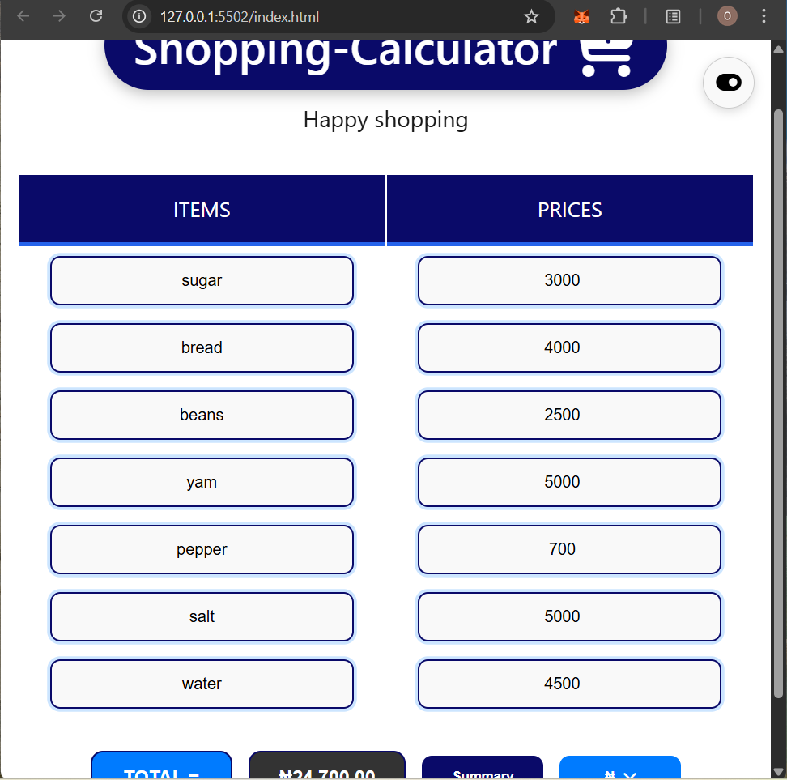
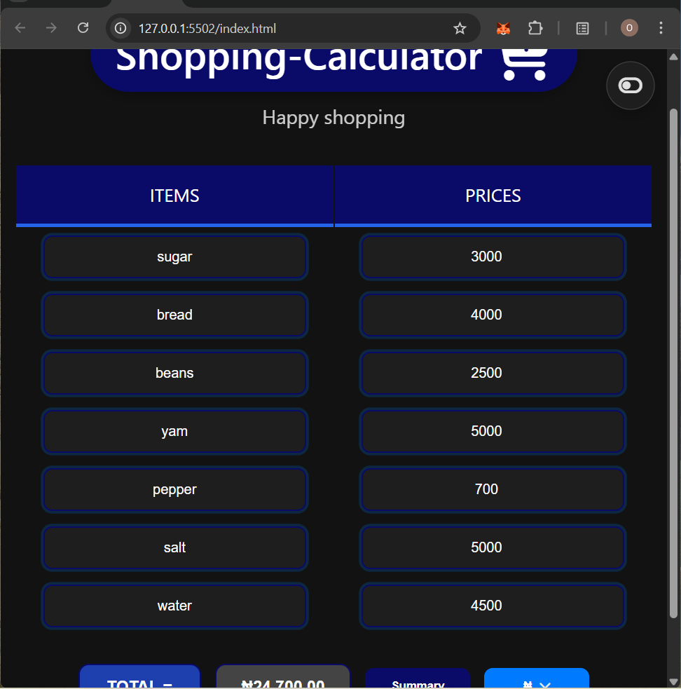
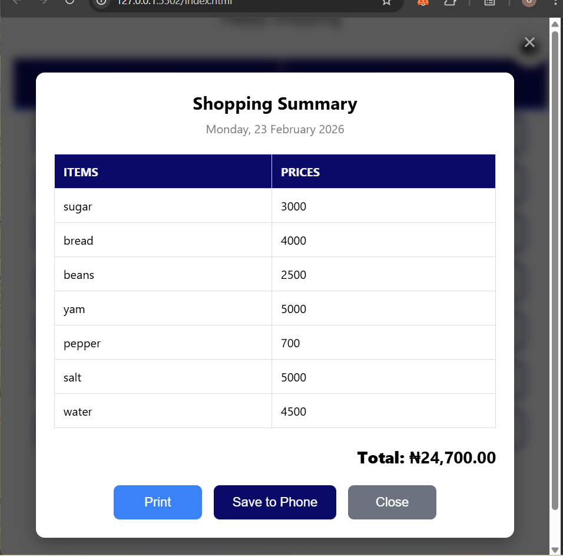
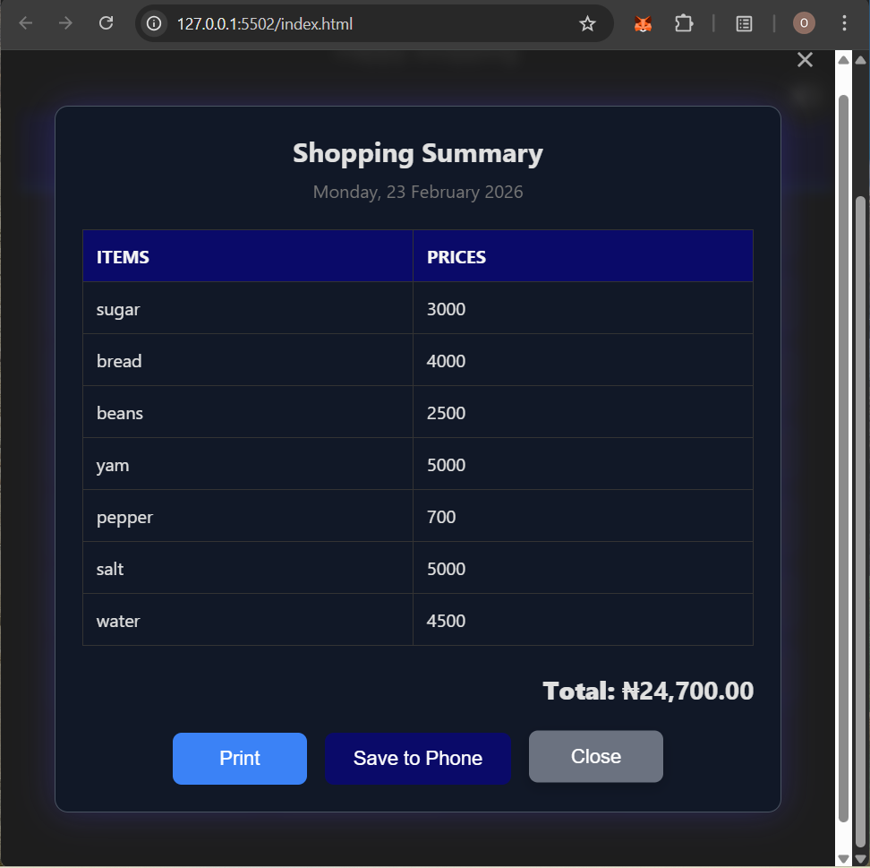

# Shopping Calculator

A clean, responsive **Shopping Calculator** built with pure HTML, CSS, and vanilla JavaScript.  
Add items and prices dynamically input, calculate totals with currency formatting, switch between light/dark mode, view a printable summary in a modal, and download or print your shopping list.
Perfect for quick market budgeting, grocery planning, or small business receipts.

## Features

- **Dynamic item rows** — press **Enter** or **Tab** in the price field to add new rows instantly
- **Real-time total calculation** with currency formatting (₦ by default, supports switching)
- **Light / Dark mode toggle** with system preference detection and persistence
- **Summary modal** displaying all items, prices, current date, and grand total
- **Print** summary directly from modal (clean print layout, no buttons)
- **Download** summary as `.txt` file (easy to save on phone/PC)
- **Responsive design** — perfect on mobile, tablet, and desktop
- **Accessibility improvements** — input names, focus management, keyboard support
- **Blocks invalid input** (e.g. letter 'e' in number fields)

## Tech Stack

- HTML5
- CSS3 (CSS Variables, Flexbox, Media Queries, Dark Mode)
- Vanilla JavaScript (ES6+, DOM Manipulation, Event Delegation)
- Font Awesome 6 (free icons via static CDN)

## Demo

Live version:  
🔗 [Live Demo] [https://shoppingcalculator2026.netlify.app/]

## Screenshots

### Light Mode



### Dark Mode



### Summary Modal

### light Modal



### dark Modal



## Getting Started

### How to Use

Type item name in the left column
Type price in the right column
Press Enter or Tab in price field → new row appears automatically
Click TOTAL to see formatted sum
Click Summary → view/print/save your shopping list
Click the toggle on/off icon (top-right) to switch themes

### Prerequisites

- Any modern browser (Chrome, Edge, Firefox, Safari)
- No build tools or dependencies needed

## Folder Structure

```bash
shopping-calculator/
│
├── index.html        # Main page
├── style.css         # All styles
├── script.js         # All JavaScript logic
├── README.md         # Project documentation
│
├── images/           # Logo, icons, assets
│
└── readmeimage/      # Screenshots for README
```

## Acknowledgments

Built with love in Nigeria
Icons from Font Awesome
Inspired by everyday market and budgeting needs
Made by Nofisat — February 2026
